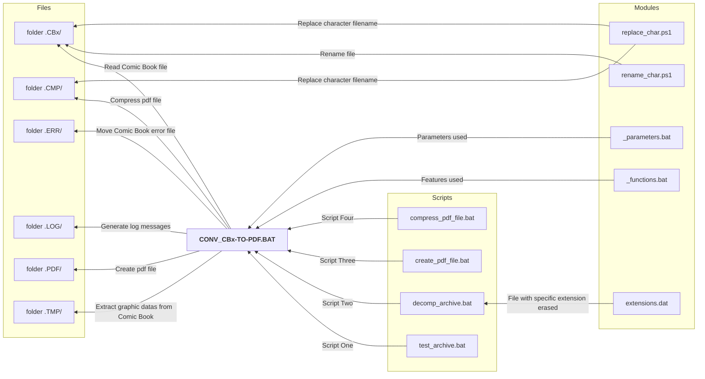

## About

Script, Dos batch call [CONV_CBx-TO-PDF.BAT](https://github.com/FremyEtCie/DOS_Scripts/tree/main/ComicBook-batch-converter) to make PDF file from Comic Book file

## Processing

Image processing for create PDF file from Comic Book (CBR & CBZ extensions) with 7zip / ImageMagik / NConvert / Ghostscript tools on a Windows x64 bit platform

## Building with

* VSC :: v1.101.2 64bits
* OS :: Windows_NT x64 10.0.19045

## Free portable tools used

* [7zip](https://www.7-zip.org/) - Version 24.08
* [ImageMagick](https://www.imagemagick.org/) - Version 7.1.1-24
* [NConvert](https://www.xnview.com/fr/nconvert/) - Version 7.121
* [Ghostscript](https://ghostscript.com/) - Version 10.3.1.0

## Minima Requirements

 - Microsoft Windows x64 bits plateform
 - CPU: 4 Cores
 - Memory: 8 to 16 Go
 - Storage: 20Go

>Tested on Windows 10 and Windows 11 operating systems with x64 architectures. The scripts have not been tested on earlier versions.

## Script Functionality

The script offers the following features:
1. Check all elements before to start scripts (test / decompress / make pdf / compress pdf)
2. Create a log file into the folder .LOG/
3. Detect pdf file and copy it into the folder .PDF/ for compressionn
4. Test compression file. If issues then move file into .ERR/ folder (Script one)
5. Decompress file from .CBx/ into the folder .TMP/ and test graphic elements plus delete other inside it (Script two)
5. Make a pdf file and put it into the folder .PDF/ (Script three)
7. Compress the pdf file into the folder .CMP/ (Script four)
8. Delete temporary files and display elapsed time

## Usage

Put all the Comic Book files to convert into the folder ComicBook-batch-converter/files/.CBx/ and launch the dos script CONV_CBx-TO-PDF.BAT to create pdf files in the final folder ComicBook-batch-converter/files/.CMP/.

## Processes



## Folder structure

```list
 ComicBook-batch-converter/
 CONV_CBx-TO-PDF.BAT
 +-- scripts/ - Scripts and Modules used
 |   +-- extensions.dat
 |   +-- _functions.bat
 |   +-- _parameters.bat
 |   +-- compress_pdf_file.bat
 |   +-- create_pdf_file.bat
 |   +-- decomp_archive.bat
 |   +-- test_archive.bat
 |   +-- rename_char.ps1
 |   +-- replace_char.ps1
 +-- files/
 |   +-- .CBX/ - files to convert folder (cbx, cbz, pdf)
 |   |   +-- fichier1.CBX
 |   |   +-- fichier2.CBZ
 |   |   +-- fichier3.PDF
 |   +-- .CMP/ - pdf files compressed
 |   |   +-- fichier1.PDF
 |   |   +-- fichier2.PDF
 |   |   +-- fichier3.PDF
 |   +-- .ERR/ - files can't convert with issues (cbx, cbz)
 |   |   +-- fichier0.CBX
 |   |   +-- fichier4.CBZ
 |   +-- .LOG/ - generate rapport from the batch script
 |   |   +-- rapport_13102022-14h24.txt
 |   +-- .PDF/ - pdf files created
 |   |   +-- fichier1.PDF
 |   |   +-- fichier2.PDF
 |   |   +-- fichier3.PDF
 |   +-- .TMP/ - Temporary folder
 |   |   +-- fichier1/
 |   |   +-- fichier2/
 |   |   +-- fichier3/
 |   |   +-- listeCB.txt
 |   |   +-- PictureListToDo.txt
 +-- tools/
 |   +-- 01.decompress_cbx/ - Decompress Rar and Zip file
 |   |   +-- 7z.dll
 |   |   +-- 7z.exe
 |   +-- 02.convert_cbx/ - Convert picture file
 |   |   +-- nconvert.exe
 |   |   +-- vcomp120.dll
 |   +-- 03.create_pdf/ - Create pdf file
 |   |   +-- convert.exe
 |   |   +-- magick.exe
 |   +-- 04.compress_pdf/ - Compress pdf file
 |   |   +-- gswin64c.exe
 |   |   +-- gswin64c.dll
 |   |   +-- gswin64c.lib
```

## Screenshots


## ToDo List

- 7zip
  - [x] decompress zip and rar format file (CBR = Rar! / CBZ = PK)
  - [x] decompress all file in an only one folder
  - [x] long file name accepted
  - [x] check viability of the file to decompress
  - [x] move file with error in a specific folder
- ImageDisk
  - [x] Convert all image file to a PDF file
  - [ ] use multi threading job
- NConvert
  - [x] convert JPEG file not recongnized by ImageDisk (photoshop issues)
  - [x] convert JPEG and PNG file to 72 dpi and A4 format
  - [x] add debug parameters
- ImageMagick
  - [x] auto orient and normalize picture
  - [x] add debug parameters
  - [x] add xml properties files
- Ghostscript
  - [x] compress pdf files in compatibility level 1.5
  - [x] compress mono or color image resolution in 72 dpi
- CONV_CBx-TO-PDF.BAT
  - [x] check first using (delete todelete.txt file)
  - [x] check tools available before
  - [x] check file(s) to convert available before (cbr or cbz or pdf file)
  - [x] generate report file of treatment (*listeCBErr.txt log file)
  - [x] generate list of file for treatment (listeCB.txt file)
  - [x] treatment of n file with loop indicated (listeCB.txt file)
  - [x] indicate which file in treatment (PictureListToDo.txt file)
  - [x] delete files which should not included inside the PDF file with extension or filename like:
    - [x] *.1
    - [x] *.tif
    - [x] *.pdf
    - [x] *.rtf
    - [x] *.htm*
    - [x] *.txt
    - [x] *.xml
    - [x] *.sfv
    - [x] *.nfo
    - [x] *.afi
    - [x] *.old
    - [x] *.csv*
    - [x] *.db
    - [x] *.url
    - [x] *.tmp
    - [x] *.rar
    - [x] *.r0*
    - [x] *.r1*
    - [x] *.alv
    - [x] *.zip
    - [x] *.sfv
    - [x] *.webloc
    - [x] descript.ion
    - [x] .directory
    - [x] Thumbs.db
    - [x] .DS_Store folder and contents from Mac
    - [x] detect a non image file with a proper list designed
  - [x] detect if no file decompressed
  - [x] remove / delete old folder temporary unused after
- Create tests with bad files
  - [x] make non regression tests

## License

[Copyright (c) 2022-2025 Frémy&Cie](https://github.com/FremyEtCie/DOS_Scripts/blob/main/ComicBook-batch-converter/LICENSE.md)